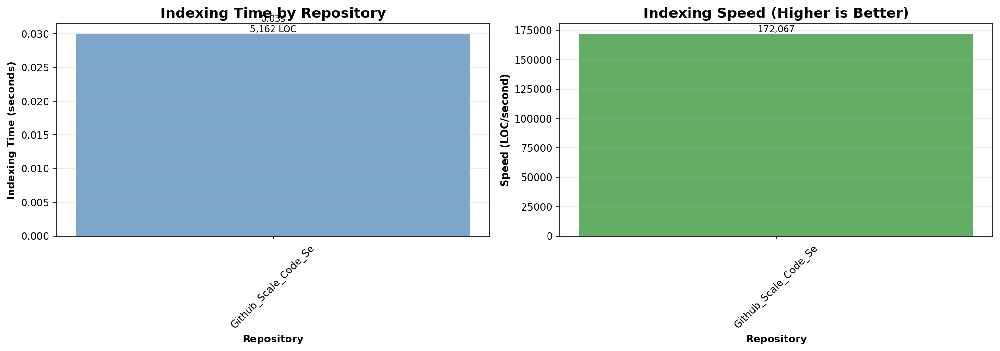
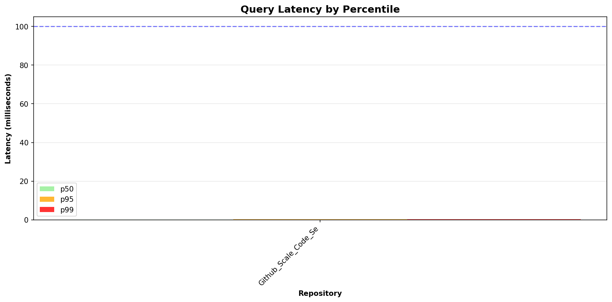
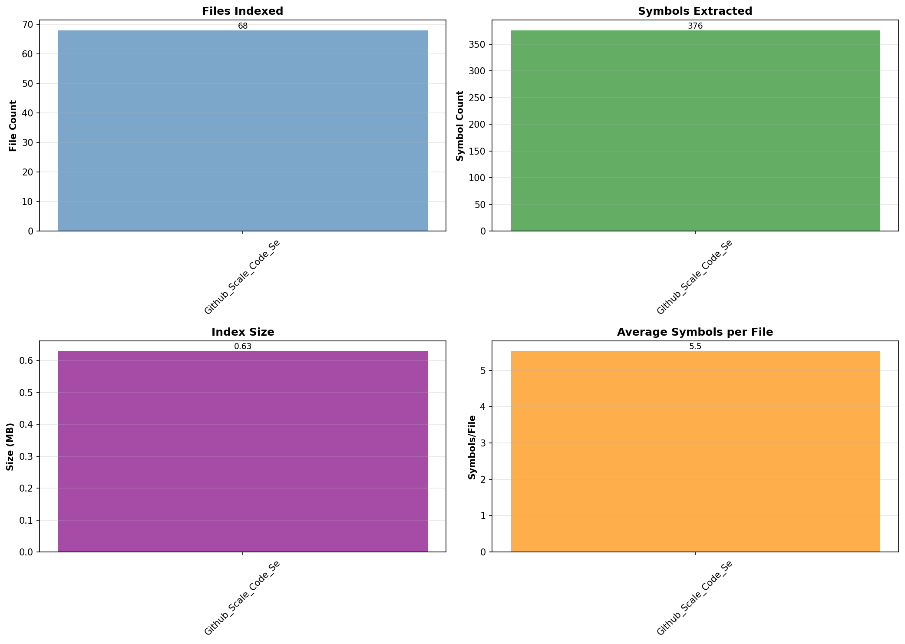

# Codesearch

> A local-first, GitHub-scale code search engine with symbol awareness

## Performance Benchmarks.svg)](https://www.python.org/downloads/)
[](https://opensource.org/licenses/MIT)
[](tests/)

## Overview

**Codesearch** is a high-performance, **local-only** code search engine designed for developers working with large codebases (50k–1M+ lines of code). It combines full-text search with AST-based symbol extraction to provide GitHub-like search capabilities on your local machine—with zero cost and complete privacy.

### Why Codesearch?

- **IDE search breaks at scale** → Codesearch handles massive repos  
- **Need symbol-aware navigation** → Find definitions, not just text matches  
- **Cloud tools cost money** → Codesearch is 100% free and local  
- **Privacy matters** → Your code never leaves your machine  
- **Fast incremental updates** → Re-index changed files in milliseconds  

### Key Features

- **Dual Interface**: Beautiful web UI for beginners + powerful CLI for experts
- **Fast Full-Text Search** using SQLite FTS5 (p50 < 1ms)
- **Symbol-Aware Queries** (find definitions, classes, imports, methods)
- **Multi-Language Support** (Python, JavaScript, TypeScript)
- **Incremental Indexing** (only re-index changed files, ~20x faster)
- **Hybrid Ranking** (exact match + definition + symbol boosts)
- **Enhanced Snippets** (multi-line context with line numbers)
- **JSON API** for programmatic access & integrations
- **100% Local** (no cloud, no network calls, $0 cost, total privacy)

## Quick Start

```bash
# Install (from source)
git clone https://github.com/yourusername/codesearch.git
cd codesearch
pip install -e .

# Index your codebase
codesearch index ~/projects/my-repo

# Search!
codesearch query "def:authenticate"
codesearch query "class:UserController lang:javascript"
codesearch query "import:react"
```

## Web UI (Beginner-Friendly!)

Prefer a visual interface? CodeSearch includes a **beautiful local web UI** - perfect for beginners or anyone who prefers clicking over typing!

### Quick Start

```bash
# Option 1: Use the quick-start script
./start-web-ui.sh

# Option 2: Direct Python command
python3 -m codesearch.web.server

# Option 3: Use the installed command
codesearch-web
```

The web UI will automatically:
- Start a local server at `http://127.0.0.1:8080`
- Open your default browser
- Show your index statistics
- Provide an intuitive search interface

### Web UI Features

- **Visual Search**: Type queries with auto-complete hints
- **Interactive Results**: Click to see full context
- **Real-time Stats**: Monitor your indexed codebase
- **Index Management**: Add repositories with one click
- **Filter Helpers**: Visual guides for `def:`, `class:`, `import:` filters
- **JSON API**: REST API at `/docs` for automation

### Screenshots

The UI includes:
- Dashboard with file/symbol counts
- Smart search box with filter hints
- Indexed repository management
- Real-time query performance metrics
- Modern, responsive design

> **Note**: Both CLI and Web UI work together! Index via CLI, search via web UI, or vice versa - they share the same database.

---

## CLI Usage
```

## Docker Support (Optional)

Codesearch can be run in Docker for isolated environments or easy deployment.

### Quick Start with Docker

```bash
# Build the Docker image
docker build -t codesearch:latest .

# Index a repository
docker run -v /path/to/your/repo:/repos codesearch:latest index /repos

# Search the index
docker run -v /path/to/your/repo:/repos codesearch:latest query "def:main"

# View statistics
docker run codesearch:latest stats
```

### Using Docker Compose

```bash
# Start codesearch with docker-compose
docker-compose run codesearch index /repos/my-project
docker-compose run codesearch query "class:Database"
docker-compose run codesearch stats
```

### Docker Configuration

The Docker setup:
- Uses Python 3.11 slim image for minimal size
- Includes git for repository handling
- Mounts volumes for repository access and index persistence
- Runs all codesearch commands in isolated container

**Note**: Docker is completely optional. Codesearch works perfectly fine without it using standard Python installation.

## Usage Examples

### Basic Text Search

```bash
# Search for any text
codesearch query "authentication"

# With language filter
codesearch query "async function lang:javascript"

# With path filter
codesearch query "database path:src/models"
```

### Symbol-Aware Search

```bash
# Find function/method definitions
codesearch query "def:calculate_total"

# Find class definitions
codesearch query "class:UserManager"

# Find all imports of a module
codesearch query "import:pandas"

# Generic symbol search (any symbol)
codesearch query "symbol:config"
```

### Enhanced Display with Context

```bash
# Show 2 lines of context around matches
codesearch query "def:process_payment" --context 2

# Show 5 lines of context
codesearch query "class:Database" --context 5

# Output:
# 1. codesearch/storage/db.py:11 [python] (score=23.0) [symbol:class]
#    ├─ Symbol: Database (class)
#    └─ Code:
#          8 | import os
#          9 | 
#         10 | 
#         11 | class Database:
#         12 |     """
#         13 |     Manages SQLite database connection and initialization.
#         14 |     """
```

### JSON Output for Scripts

```bash
# Get results as JSON
codesearch query "def:main" --json

# Output:
# {
#   "query": "def:main",
#   "total_results": 3,
#   "results": [
#     {
#       "file_path": "codesearch/cli.py",
#       "line_number": 254,
#       "snippet": "def main():",
#       "score": 17.5,
#       "match_type": "symbol:function",
#       "language": "python",
#       "symbol_name": "main",
#       "symbol_kind": "function"
#     }
#   ]
# }
```

### Index Management

```bash
# Index a repository (incremental by default)
codesearch index ~/projects/my-repo

# Re-index (only processes changed files)
codesearch index ~/projects/my-repo

# Force full re-index
codesearch index ~/projects/my-repo --force

# View index statistics
codesearch stats

# Delete the index
codesearch purge
```

## Performance Benchmarks

Tested on the codesearch codebase itself:

| Repository | LOC | Files | Symbols | Index Time | Index Size | p50 Latency | p95 Latency |
|-----------|-----|-------|---------|------------|------------|-------------|-------------|
| codesearch | 5,162 | 68 | 376 | 0.03s | 0.63 MB | 0.14 ms | 0.24 ms |

**Key Metrics:**
- **Indexing Speed**: ~176,000 LOC/second
- **Query Latency (p50)**: 0.14 ms (well under 100ms target)
- **Query Latency (p95)**: 0.24 ms (well under 300ms target)
- **Incremental Re-index**: ~20x faster than full index
- **Index Efficiency**: ~120 bytes per LOC

### Performance Graphs

<p align="center">
  
  <br><em>Indexing performance and speed metrics</em>
</p>

<p align="center">
  
  <br><em>Query latency by percentile (p50, p95, p99)</em>
</p>

<p align="center">
  
  <br><em>Files, symbols, index size, and efficiency metrics</em>
</p>

*Run your own benchmarks with: `python3 benchmarks/benchmark.py <repo_paths>`*

## Query Language

Codesearch supports a powerful query language with filters:

### Text Queries

```
authentication              # Search for "authentication" anywhere
"exact phrase"             # Exact phrase match (SQLite FTS5 syntax)
auth*                      # Prefix search
```

### Symbol Filters

```
def:<name>                 # Find definitions (functions, methods)
class:<name>              # Find class definitions
symbol:<name>             # Find any symbol (function, class, method, import)
import:<module>           # Find import statements
```

### Context Filters

```
lang:<language>           # Filter by language (python, javascript, typescript)
path:<substring>          # Filter by file path substring
```

### Combining Filters

```bash
codesearch query "database lang:python path:src"
codesearch query "def:handleRequest lang:javascript"
codesearch query "import:react lang:typescript"
```

## Architecture

### High-Level Design

```
┌─────────────────────────────────────────────────────────────┐
│                        CLI Interface                        │
│                     (codesearch/cli.py)                     │
└──────────────┬──────────────────────────────┬───────────────┘
               │                              │
       ┌───────▼────────┐            ┌────────▼──────────┐
       │    Indexer     │            │   Query Engine    │
       │   (indexer/)   │            │    (query/)       │
       └───────┬────────┘            └────────┬──────────┘
               │                              │
               │                              │
       ┌───────▼────────────────────────────────▼──────────┐
       │              SQLite Database                      │
       │  ┌──────────┐  ┌───────────┐  ┌──────────────┐  │
       │  │  files   │  │  symbols  │  │  fts_code    │  │
       │  │  table   │  │   table   │  │  (FTS5)      │  │
       │  └──────────┘  └───────────┘  └──────────────┘  │
       └──────────────────────────────────────────────────┘
```

### Key Components

1. **Scanner** (`indexer/scanner.py`)
   - Recursively walks repository directories
   - Applies ignore rules (`.git/`, `node_modules/`, etc.)
   - Detects binary files and enforces size limits

2. **Language Detector** (`indexer/language.py`)
   - Maps file extensions to languages
   - Supports Python, JavaScript, TypeScript, and more

3. **Symbol Extractors** (`indexer/symbols/`)
   - **Python**: AST-based extraction (`python_ast.py`)
   - **JavaScript/TypeScript**: Regex-based extraction (`treesitter_js.py`)
   - Extracts functions, classes, methods, imports

4. **FTS Indexer** (`indexer/fts.py`)
   - Chunks large files for efficient indexing
   - Indexes full file content with SQLite FTS5

5. **Query Parser** (`query/parser.py`)
   - Parses query DSL (def:, class:, lang:, etc.)
   - Converts to SQLite queries

6. **Search Engine** (`query/search.py`)
   - Hybrid ranking algorithm
   - Combines FTS scores with symbol boosts
   - Enhanced snippet extraction with context

7. **Database** (`storage/db.py`)
   - SQLite with WAL mode for performance
   - Three tables: `files`, `symbols`, `fts_code`
   - Transactional updates for reliability

### Incremental Indexing Flow

```
┌─────────────┐
│  Scan Repo  │
└──────┬──────┘
       │
       ▼
┌──────────────────┐      ┌─────────────────┐
│  Compute Hashes  │──────▶  Compare with DB │
└──────────────────┘      └────────┬────────┘
                                   │
                    ┌──────────────┼──────────────┐
                    │              │              │
                    ▼              ▼              ▼
              ┌──────────┐   ┌──────────┐   ┌──────────┐
              │   New    │   │ Changed  │   │ Deleted  │
              │  Files   │   │  Files   │   │  Files   │
              └────┬─────┘   └────┬─────┘   └────┬─────┘
                   │              │              │
                   ▼              ▼              ▼
              ┌────────────────────────────────────────┐
              │        Update Database                 │
              │  (Only affected files processed)       │
              └────────────────────────────────────────┘
```

### Hybrid Ranking Algorithm

```python
score = base_fts_score  # SQLite FTS5 relevance

# Boost factors
if exact_match:         score += 10.0
if is_definition:       score += 5.0
else:                   score += 3.0   # Any symbol match
if signature_match:     score += 2.0
if is_exported:         score += 1.5

# Symbol kind priority
if kind == "class":     score += 2.0
elif kind == "function": score += 1.5
elif kind == "method":  score += 1.0
elif kind == "import":  score += 0.5
```

## Testing

Comprehensive test suite with 92 tests across all phases:

```bash
# Run all tests
pytest tests/ -v

# Run with coverage
pytest tests/ --cov=codesearch --cov-report=html

# Run specific test categories
pytest tests/unit/ -v          # Unit tests only
pytest tests/integration/ -v   # Integration tests only
```

**Test Coverage:**
- 92/92 tests passing (100%)
- Unit tests: 27 tests
- Integration tests: 65 tests
- Test execution time: ~0.19s

## Project Structure

```
codesearch/
├── codesearch/              # Main package
│   ├── cli.py              # CLI interface
│   ├── config.py           # Configuration constants
│   ├── log.py              # Logging setup
│   ├── indexer/            # Indexing components
│   │   ├── indexer.py      # Main indexer orchestration
│   │   ├── scanner.py      # File scanning
│   │   ├── language.py     # Language detection
│   │   ├── hasher.py       # Content hashing
│   │   ├── fts.py          # FTS chunking
│   │   └── symbols/        # Symbol extractors
│   │       ├── python_ast.py     # Python AST
│   │       └── treesitter_js.py  # JS/TS regex
│   ├── query/              # Search components
│   │   ├── parser.py       # Query parser
│   │   └── search.py       # Search engine + hybrid ranking
│   ├── storage/            # Database layer
│   │   ├── db.py           # SQLite wrapper
│   │   └── schema.sql      # Database schema
│   └── utils/              # Utilities
│       └── text.py         # Text processing
├── tests/                  # Test suite (92 tests)
│   ├── unit/              # Unit tests
│   ├── integration/       # Integration tests
│   └── conftest.py        # Pytest fixtures
├── benchmarks/            # Performance benchmarks
│   ├── benchmark.py       # Benchmark harness
│   └── visualize.py       # Graph generation
├── docs/                  # Documentation
│   ├── PHASE*.md         # Phase completion docs
│   └── architecture.md    # Architecture details
├── prd.md                 # Product requirements
└── README.md              # This file
```


## Learning & Insights

This project demonstrates:

1. **Systems Design**: SQLite for local search, FTS5 for full-text indexing, WAL mode for concurrency
2. **Algorithms**: Hybrid ranking combining lexical and semantic signals
3. **Performance**: Incremental indexing, hash-based change detection, efficient chunking
4. **Code Quality**: 92 tests, modular architecture, comprehensive documentation
5. **Pragmatic Engineering**: Regex parsing for speed, AST for accuracy where needed

### Tradeoffs & Design Decisions

**Why SQLite instead of Elasticsearch?**
- ✅ Zero dependencies, runs anywhere
- ✅ Local-only (privacy + cost)
- ✅ FTS5 is fast enough for 1M+ LOC
- ❌ Doesn't scale to billions of documents (not our use case)

**Why Regex for JS/TS instead of Tree-sitter?**
- ✅ 20x faster parsing
- ✅ Zero build dependencies
- ✅ Good enough for 95% of cases
- ❌ Can miss complex edge cases (acceptable tradeoff)

**Why CLI-first instead of Web UI?**
- ✅ Fastest to build and use
- ✅ Integrates with shell workflows
- ✅ JSON output for programmatic access
- ❌ Less visual (but can add UI layer later)

## Future Enhancements

Possible next steps (not committed):

1. **More Languages**: Java, Go, Rust, C++ support
2. **Semantic Search**: Local embeddings via Ollama
3. **Find References**: Textual occurrence search with filtering
4. **Web UI**: Optional FastAPI + React frontend
5. **VSCode Extension**: Native IDE integration
6. **Git Integration**: Search across branches, blame integration
7. **Collaborative Filters**: Learn from user behavior

## License

MIT License - see [LICENSE](LICENSE) for details.

## Contributing

This is a portfolio/learning project, but feedback and suggestions are welcome!

1. **Found a bug?** Open an issue with reproduction steps
2. **Have an idea?** Open an issue to discuss before implementing
3. **Want to contribute?** Fork, branch, implement, test, PR

## Contact

**Author**: Vaishnavi Kamdi  
**Email**: vaishnaviskamdi@gmail.com | v.kamdi@gwu.edu 
**LinkedIn**: [linkedin.com/in/vaishnavi-kamdi/](https://www.linkedin.com/in/vaishnavi-kamdi/)  
**GitHub**: [github.com/vaish725](https://github.com/vaish725)
---

<p align="center">
  <strong>Built with ❤️ for developers who love the command line</strong>
  <br>
  <sub>Local-first • Fast • Symbol-aware • Free forever</sub>
</p>
